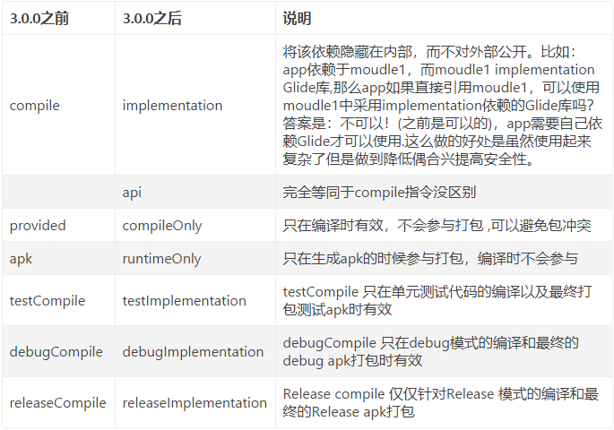

# 详解build.gradle文件
* Android Studio是采用 Gradle来构建项目的， Gradle一个非常先进的项目构建工具，使用一种Groovy的特定领域特定语言(DSL)来声明项目设置
* 对于安卓项目来说，一个项目中有两个build.gradle文件，一个在最外层，一个在app目录下面，这两个文件对于构建Android Studio项目都有至关重要的作用

## 最外层build.gradle文件简述
1. 项目文件
    ```groovy
        buildscript{
                repositories{
                    jcenter()
                }
                dependencies{
                    classpath 'com.android.tools.build:gradle:2.2.0'
                }
            }
        
        allprojects {
            repositories{
                jcenter()
            }
        }
         task clean(type: Delete) {
             delete rootProject.buildDir
         }
    ```
2. 说明
    1. jcenter()这行配置是什么?
        * 其实他是一个代码托管仓库, 很多开源安卓项目都会将代码托管到jcenter上, 声明了这行配置  我们就可以轻松的引用任何jcenter上的开源项目了

    2. dependencies
        * 使用classpath声明了一个Gradle插件
        * 因为gradle并不是专为构建安卓而开发的，所以想要使用它构建安卓项目需要声明com.android.tools.build:gradle:x.x.x
    
    3. 一般不需要修改这个文件，除非想要添加一些全局的项目构建配置 

## 模块内的项目文件
1. 内层项目文件
    ```groovy
    apply plugin: 'com.android.application'
    
    android {
        compileSdkVersion 28
        defaultConfig {
            applicationId "top.lcwspr.studyandroid"
            minSdkVersion 28
            targetSdkVersion 28
            versionCode 1
            versionName "1.0"
            testInstrumentationRunner "android.support.test.runner.AndroidJUnitRunner"
        }
        buildTypes {
            release {
                minifyEnabled false
                proguardFiles getDefaultProguardFile('proguard-android.txt'), 'proguard-rules.pro'
            }
        }
    }
    
    dependencies {
        implementation fileTree(dir: 'libs', include: ['*.jar'])
        implementation 'com.android.support:appcompat-v7:28.0.0'
        implementation 'com.android.support.constraint:constraint-layout:1.1.3'
        testImplementation 'junit:junit:4.12'
        androidTestImplementation 'com.android.support.test:runner:1.0.2'
        androidTestImplementation 'com.android.support.test.espresso:espresso-core:3.0.2'
    }
    ```
2. 说明
    1. 第一行应用了一个插件(一般有两种值可以选择)
        1. `com.android.application` : 表名这是一个应用程序模块（可以独立运行）
        2. `com.android.library` : 表名这个是一个库模块（必须依赖别的应用程序模块运行）
    2. 接下来是一个大的android闭包  
        * 在这个闭包中, 我们可以配置项目构建的各种属性
            1. compileSdkVersion 用于指定项目的编译版本   
                * 24  表示为 Android 7.0 的sdk编译
            2. buildToolsVersion 用于指定项目构建工具的版本

        * 之后嵌套了一个defaultConfig闭包, 可以对于项目的更多细节进行配置。
            1. applicationID 
                * 用于指定项目的包名, 其实创建项目的时候就会指定,如果想要修改可以在这里修改
            2. minSdkVersion 
                * 指定项目最低兼容的Android版本
            3. targetSdkVersion  
                * 说明已经在该版本充分测试过程序
            4. versionCode
                * 指定项目的版本号
            5. versionName  
                * 指定项目的版本名
        * buildTypes闭包
            * 用于指定生成安装文件的相关配置
            * 通常只会有两个子闭包 -- debug(可以省略) -- release
            * release闭包中的内容
                1. minifyEnabled: 用于指定是否对项目的代码进行混淆(true表示混淆)
                2. proguardFiles: 用于指定混淆时使用的规则文件(默认指定了两个文件)
                    1. proguard-android.txt : AndroidSdk目录下  通用的混淆规则
                    2. proguard-rules.pro : 当前项目的根目录下

    3. 还剩下一个，dependencies闭包，可以指定当前项目所有的依赖关系
        * 通常android studio项目一共有3中依赖关系  （本地依赖   库依赖  远程依赖）
            1. 本地依赖可以对于本地的jar包或者目录添加依赖关系
            2. 库依赖则可以对项目中的库模块添加依赖关系
            3. 远程依赖则可以对于jcenter库上的开源项目添加依赖关系

        * 依赖声明
            1. `implementation fileTree(dir: 'libs', include: ['*.jar'])`
                * 就是一个本地依赖声明,表示将libs目录下的所有.jar都添加到项目的构建路径
            2. `implementation 'com.android.support:appcompat-v7:28.0.0'`
                * 则是一个远程依赖声明(如果加上这句,gradle会首先检查本地是否已有了这个库的缓存 没有去联网去下载)
                * com.android.support 是域名部分,用于和其他库区分
                * appcompat-v7 是组名称,用于和同一个公司中不同库作区分
                * 24.2.1是版本号 用于和同一个库的不同版本做区分
            3. `implementation project 后面加上依赖的库名称`  
                * 库依赖声明，声明所依赖的库模块                 
                    
## gradle 3.x.x 变动说明
* implementation  使用该命令编译的依赖  他仅仅对于当前的module提供接口
* 依赖变动图解
    * 
    
* 全局项目配置文件说明
    * buildscript:用来加载gradle脚本自身需要使用的资源,可以声明的资源包括依赖项、第三方插件、maven仓库地址等
    * repositories表示代码仓库的下载来源
        * jcente 是一个新的中央远程仓库，兼容maven中心仓库，而且性能更优.
        * google 是google的代码托管仓库
    * dependencies一般是执行Gradle需要的gradle工具。
    * classpath 执行gradle需要的工具地址，一般版本号同studio版本保持一致
    * allproject 是整个项目的配置，比如allproject 中的repositories和上面buildscript的区别就是：前者allproject是整个项目本身需要的依赖，后者是gradle脚本执行所需依赖（Gradle插件），分别是对应的maven仓库和插件依赖等
    * task clear 运行gradle clean时，执行此处定义的task. 该任务继承自Delete，删除根目录中的build目录。

## 依赖语法
1. 远程依赖方式
    1. 方式1
        * `implementation 'com.android.support.constraint:constraint-layout:1.1.2'`
    2. 方式2
        * `implementation group: 'com.android.support.constraint', name: 'constraint-layout', version: '1.1.2'`
    3. 方式3
        ```
        implementation('com.android.support.constraint:constraint-layout:1.1.2') {
            //不同版本同时被依赖时，那么强制依赖这个版本的，默认false
            force = true
            
            //exclude可以设置不编译指定的模块，有三种写法:
            exclude module: 'abc'
            exclude group: 'bcd'
            exclude group: 'abc', module: 'bcd'
            
            //禁止依赖的传递，gradle自动添加子依赖项,默认为true.
            transitive = true
        }
        ```
        * 当然我们这里的exclude 的‘abc’等内容是不存在的，只是给大家演示，由此也引出了exclude的一个作用，避免依赖包冲突。那么除了采用exclude这种方式，我们还有没有别的方法呢，答案当然是有了，那就是统一为所有依赖指定依赖包的版本，如下：
        ```groovy
            configurations.all {
                resolutionStrategy.eachDependency { DependencyResolveDetails details ->
                    def requested = details.requested
                    if (requested.group == 'com.android.support') {
                        if (!requested.name.startsWith("multidex")) {
                            details.useVersion '28.0.0-rc01'
                        }
                    }
                }
            }
        ```
